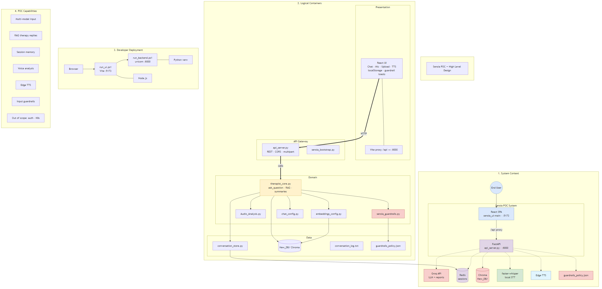
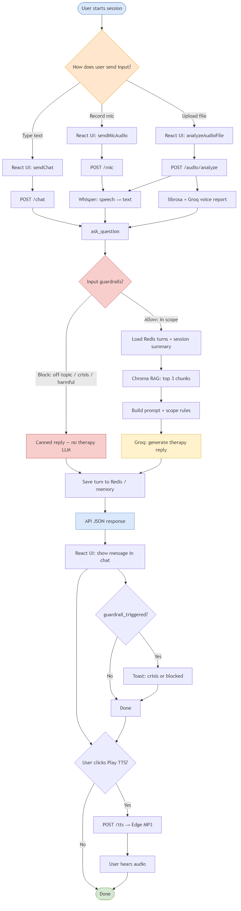
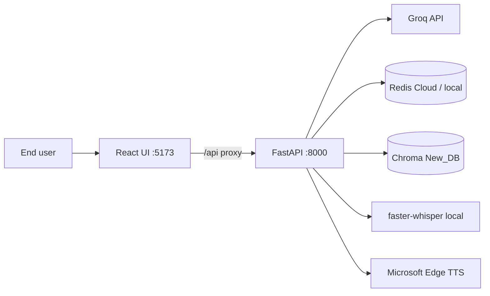
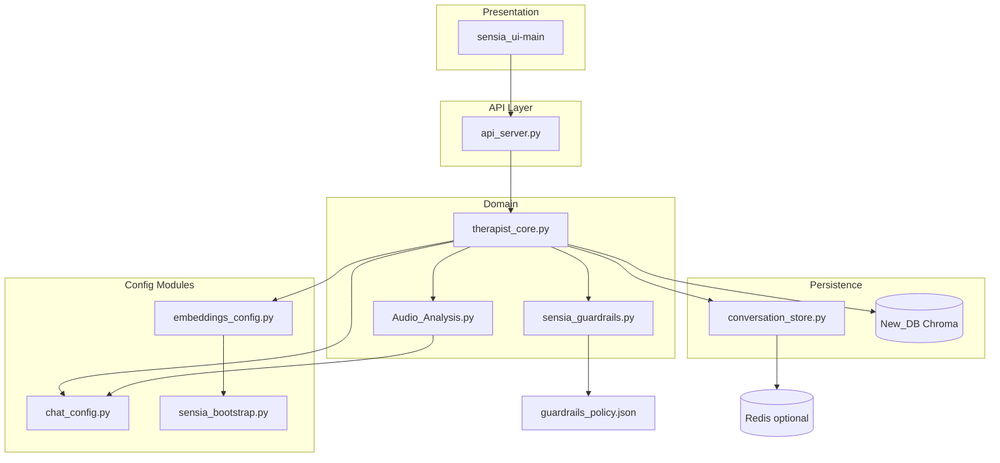

# Sensia — System Architecture

This document describes the **Sensia POC** codebase after a full review of application source, configuration, scripts, tests, and documentation. It is the canonical architecture reference for developers and demos.

**Related artifacts:**

| Artifact | Format | Use |
|----------|--------|-----|
| [Sensia-Workflow.png](Sensia-Workflow.png) | **Image** | Input → response workflow (demo) |
| [Sensia-HLD.png](Sensia-HLD.png) | **Image** | HLD diagram for docs, slides, README embed |
| [Sensia-HLD.drawio](Sensia-HLD.drawio) | Draw.io | Editable HLD (C4 containers, deployment, capabilities) |
| [Sensia-HLD.mmd](Sensia-HLD.mmd) | Mermaid | Source used to generate the PNG |
| [Sensia-LLD.drawio](Sensia-LLD.drawio) | Draw.io | Low-level modules & sequences |
| [Sensa flow diagam.drawio](Sensa%20flow%20diagam.drawio) | Draw.io | End-to-end demo pipeline |
| [readme.md](../readme.md) | Markdown | Runbook |



### Workflow: input → response

End-to-end path from user action to visible reply (best for demos and onboarding):



| Artifact | Format |
|----------|--------|
| [Sensia-Workflow.png](Sensia-Workflow.png) | PNG image |
| [Sensia-Workflow.drawio](Sensia-Workflow.drawio) | Editable vertical workflow |
| [Sensia-Workflow.mmd](Sensia-Workflow.mmd) | Mermaid source |

---

## 1. Executive summary

Sensia is a **voice and text therapy companion proof-of-concept**. Users interact through a **React SPA** (`sensia_ui-main`) that talks to a **FastAPI** backend (`api_server.py`). The backend:

- Transcribes voice with **faster-whisper**
- Optionally analyzes uploaded audio with **librosa** and a **Groq** “clinical voice” report
- Classifies input with **rule-based guardrails** before any therapy LLM call
- Retrieves context from a **Chroma** vector store (`New_DB/`)
- Maintains **session memory** in **Redis** (or in-process fallback)
- Generates replies with **Groq** (LangChain)
- Serves **Edge TTS** MP3 on demand

**Not in scope for this POC:** authentication, multi-tenancy, production Kubernetes, HIPAA compliance, or clinical certification.

---

## 2. System context



| Actor / system | Role |
|----------------|------|
| **End user** | Types, records mic, or uploads audio in the browser |
| **React UI** | Session UX, API client, TTS playback, localStorage metadata |
| **FastAPI** | REST gateway, multipart uploads, CORS, Pydantic validation |
| **Groq** | Main chat LLM + voice assessment report + summary merge LLM |
| **Redis** | Per-session turn list + rolling summary JSON (optional) |
| **Chroma** | On-disk RAG index (`New_DB/`) |
| **faster-whisper** | Local STT (CPU, `base` model) |
| **Edge TTS** | Neural speech for read-aloud |

---

## 3. Repository layout

Excluded from routine review: `venv/`, `node_modules/`, `.pytest_cache/`, `.git/`, `New_DB/` (generated), large runtime files (`data.jsonl`, `conversation_log.txt`).

```
Sensia/
├── api_server.py              # HTTP API (active entry)
├── therapist_core.py          # Domain: RAG, chat, audio, TTS, summaries
├── sensia_guardrails.py       # Input classification
├── conversation_store.py      # Redis + in-memory persistence
├── chat_config.py             # Groq LLM factory
├── embeddings_config.py       # HuggingFace embeddings singleton
├── sensia_bootstrap.py        # UTF-8 console (Windows), HF env
├── sensia_encoding.py         # Deprecated shim → sensia_bootstrap
├── Audio_Analysis.py          # librosa + Groq voice report
├── create_db.py               # Streamlit: build Chroma from data.jsonl
├── review.py                  # Streamlit: HITL log → Chroma
├── AI_Therapist.py            # Legacy stub (migration notice only)
├── guardrails_policy.json     # Guardrail patterns & canned replies
├── requirements.txt
├── .env.example               # Safe env template (commit this)
├── .gitignore
├── readme.md
├── run_backend.ps1
├── run_ui.ps1
├── tests/test_guardrails.py
├── Doc/
│   ├── architecture.md      # This file
│   ├── Sensia-HLD.drawio
│   ├── Sensia-LLD.drawio
│   └── Sensa flow diagam.drawio
├── sensia_ui-main/            # React + TanStack Start
│   ├── src/routes/index.tsx   # Main app (~960 lines)
│   ├── src/lib/api.ts         # Backend client
│   └── src/components/ui/     # shadcn/ui scaffold (40 components)
├── QUICKSTART.md              # Older Streamlit-oriented quickstart
├── UNDERSTANDING.md           # Deep dive (partially legacy Streamlit)
└── task.txt                   # Ad-hoc notes (non-runtime)
```

---

## 4. Layered architecture

| Layer | Components | Responsibility |
|-------|------------|----------------|
| **Presentation** | `sensia_ui-main` | Chat UI, mic, file upload, TTS player, session sidebar |
| **API** | `api_server.py` | Routing, CORS, request/response models, error sanitization |
| **Domain** | `therapist_core.py`, `sensia_guardrails.py`, `Audio_Analysis.py` | Business logic, pipelines, prompts |
| **Persistence** | `conversation_store.py`, `New_DB/`, `conversation_log.txt` | Turns, summaries, vectors, optional file log |
| **Integration** | `chat_config.py`, `embeddings_config.py`, Groq/Redis/Whisper/Edge | External and local ML services |
| **Bootstrap** | `sensia_bootstrap.py` | Cross-cutting UTF-8 and HF download behavior |

---

## 5. End-to-end data flows

### 5.1 Text chat (happy path)

1. User types in React → `sendChat(sessionId, message)`
2. `POST /api/sessions/{id}/chat` → `therapist_core.chat_text`
3. `ask_question(message, "", session_id)`
4. `evaluate_user_message` → **allow**
5. Chroma retriever (k=3) + Redis summary + recent turns → prompt
6. Groq LLM → reply
7. `append_turn` + optional `maybe_refresh_session_summary` (every 5 turns)
8. JSON `{ reply, turns, guardrail_triggered, guardrail_category }` → UI updates transcript

### 5.2 Microphone

1. `MediaRecorder` → blob → `sendMicAudio`
2. `POST .../mic` → SHA256 dedupe → `chat_from_mic`
3. Whisper transcribe → `ask_question(transcript, "", sid)` (no voice report)
4. Same guardrails + allow/block branches as text

### 5.3 Audio file upload (full pipeline)

1. File → `analyzeAudioFile`
2. `POST .../audio/analyze` → dedupe → librosa features → `analyze_with_openai` (Groq report) → `ask_question(transcript, report, sid)`
3. Report injected into system context (background only, not quoted to user)

### 5.4 Guardrail block

1. `evaluate_user_message` returns `action=block` (crisis / harmful / off_topic)
2. Canned reply from `guardrails_policy.json` (crisis uses `SENSIA_CRISIS_REGION`)
3. `append_turn` only — **no** main therapy LLM, **no** summary refresh for `off_topic`
4. API sets `guardrail_triggered=true`; UI `notifyGuardrail()` shows toast (stronger for crisis)

### 5.5 TTS (separate request)

1. User clicks Play on last assistant message
2. `POST .../tts` with reply text → `text_to_speech_sync` → Edge TTS MP3
3. Blob URL → single `HTMLAudioElement` (generation ref prevents overlap)

See [Sensa flow diagam.drawio](Sensa%20flow%20diagam.drawio) for the vertical pipeline diagram used in demos.

---

## 6. Backend module reference

### 6.1 `api_server.py`

FastAPI application. Imports `sensia_bootstrap` first (via `therapist_core` chain).

| Endpoint | Handler | Core function |
|----------|---------|---------------|
| `GET /api/health` | `health` | `redis_status()` |
| `POST /api/sessions` | `create_session` | `create_session_id()` |
| `GET /api/sessions/{id}/turns` | `get_turns` | `list_turns()` |
| `POST /api/sessions/{id}/chat` | `post_chat` | `chat_text()` |
| `POST /api/sessions/{id}/mic` | `post_mic` | `chat_from_mic()` |
| `POST /api/sessions/{id}/audio/analyze` | `post_audio_analyze` | `analyze_audio_upload()` |
| `POST /api/sessions/{id}/tts` | `post_tts` | `text_to_speech_sync()` → `audio/mpeg` |
| `DELETE /api/sessions/{id}` | `delete_session` | `clear_session_data()` |
| `GET /api/sessions/{id}/summary` | `get_summary` | `get_session_summary()` |

**CORS:** `CORS_ORIGINS` env or defaults including `localhost:5173`, `8080`, `3000`.

**Response models:** `ChatResponse`, `MicChatResponse`, `AudioAnalyzeResponse` include optional `guardrail_triggered` and `guardrail_category`.

---

### 6.2 `therapist_core.py`

Central domain module.

| Symbol | Purpose |
|--------|---------|
| `AskOutcome` | `reply`, `guardrail_triggered`, `guardrail_category` |
| `ask_question()` | Guardrail gate → RAG → prompt → Groq → persist |
| `chat_text` / `chat_from_mic` / `analyze_audio_upload` | Entry points from API |
| `get_vectordb()` | Lazy Chroma singleton (`New_DB/`) |
| `maybe_refresh_session_summary()` | Rolling batch summarization (default 5 turns) |
| `merge_summarize_turn_batch()` | Groq compresses turn batch into summary text |
| `transcribe_audio_file()` | faster-whisper `base` on CPU |
| `text_to_speech_sync()` | Edge TTS `en-US-JennyNeural` |
| `_processed_mic_sigs` / `_processed_audio_sigs` | In-process SHA256 dedupe per session |

**Prompting:** `custom_prompt` + `GUARDRAIL_SCOPE_RULES` in system context; psychological report only on upload path.

**Logging:** `log_interaction()` appends JSON lines to `conversation_log.txt` (optional audit trail).

---

### 6.3 `sensia_guardrails.py` + `guardrails_policy.json`

| Function | Behavior |
|----------|----------|
| `guardrails_enabled()` | Reads `SENSIA_GUARDRAILS_ENABLED` (default on) |
| `evaluate_user_message(text)` | Priority: crisis → harmful → off_topic → allow |
| `GuardrailResult` | `action`, `category`, `reply` |

**Policy file** (`guardrails_policy.json`): regex lists, phrase lists, `emotional_override_patterns` (allows emotional mention of politics/news), region-specific `crisis_regions` (IN/US/UK).

**Tests:** `tests/test_guardrails.py` (7 cases, no Groq/Redis required).

---

### 6.4 `conversation_store.py`

| Redis key | Value |
|-----------|--------|
| `{REDIS_KEY_PREFIX}{session_id}` (default `sensia:chat:`) | LIST of JSON `{user, bot}` |
| `{REDIS_SUMMARY_PREFIX}{session_id}` (default `sensia:summary:`) | JSON `{text, cursor}` |

**Fallback:** Module-level `_memory_store` and `_memory_summary` if Redis unreachable or `REDIS_DISABLED=1`.

**Connection:** `REDIS_URL` or composed from `REDIS_HOST`, `REDIS_PORT`, `REDIS_PASSWORD`, `REDIS_DB`, `REDIS_SSL`.

---

### 6.5 `chat_config.py`

- `get_chat_llm(temperature)` → `ChatGroq` using `GROQ_API_KEY`, model from `GROQ_MODEL` (default `llama-3.3-70b-versatile`).

Used for: main replies, audio assessment report, session summary merge.

---

### 6.6 `embeddings_config.py`

- Singleton `HuggingFaceEmbeddings` — `sentence-transformers/all-mpnet-base-v2`, normalized vectors.
- Shared by `therapist_core`, `create_db.py`, `review.py`.

---

### 6.7 `Audio_Analysis.py`

| Function | Purpose |
|----------|---------|
| `extract_audio_features(y, sr)` | librosa: pitch, energy, pauses, etc. |
| `analyze_with_openai(transcription, features)` | Groq generates clinical-style voice report (name is legacy) |
| `AudioReportGenerator` | Structured report builder |

Disclaimer in module: supportive signals only, not diagnosis.

---

### 6.8 `sensia_bootstrap.py` / `sensia_encoding.py`

- On import: reconfigure stdout/stderr to UTF-8 on Windows; set `HF_HUB_DISABLE_PROGRESS_BARS`, etc.
- **Must import early** — done in `api_server` (via core) and `embeddings_config`.

`sensia_encoding.py` re-exports `configure_stdio` for backward compatibility.

---

### 6.9 Legacy / tooling modules

| File | Status | Use |
|------|--------|-----|
| `create_db.py` | Active tool | `streamlit run create_db.py` — ingest `data.jsonl` → `New_DB/` |
| `review.py` | Active tool | Review `conversation_log.txt` → update Chroma |
| `AI_Therapist.py` | Deprecated | Prints instructions to use React + FastAPI |
| `QUICKSTART.md` / `UNDERSTANDING.md` | Partially outdated | Historical Streamlit docs; cross-check with `readme.md` |

---

## 7. Frontend architecture (`sensia_ui-main`)

### 7.1 Stack

- **TanStack Start** + **TanStack Router** (single route `/`)
- **Vite** dev server with `/api` → `127.0.0.1:8000`
- **React Query** in root layout
- **Tailwind CSS v4** + **shadcn/ui** component library (mostly scaffold)
- **sonner** toasts, **lucide-react** icons
- Optional **Cloudflare** deploy via `wrangler.jsonc` + `src/server.ts`

### 7.2 Key source files

| File | Role |
|------|------|
| `src/routes/index.tsx` | **TherapistApp** — sessions, chat, mic, upload, TTS, placeholders for “Speech & emotion” / “Session insights” (static, not wired to backend) |
| `src/lib/api.ts` | Typed HTTP client; `GuardrailMeta` on chat/mic/analyze |
| `src/routes/__root.tsx` | Layout, QueryClient, Toaster |
| `src/router.tsx` / `src/routeTree.gen.ts` | Router setup (only `/` route) |
| `src/server.ts` | SSR / Cloudflare entry with error normalization |
| `src/components/ui/*` | 40 shadcn primitives; production UI primarily uses buttons, inputs, scroll areas, sonner |

### 7.3 Client-side state

| Storage | Keys / data |
|---------|-------------|
| **Server** | Canonical turn history per `session_id` |
| **localStorage** | `sensia.sessions.v1` (titles, bookmarks), `sensia.activeSession.v1` |
| **In-memory refs** | `ttsAudioRef`, `ttsGenerationRef`, `ttsLoadingRef` — prevent double TTS playback |

### 7.4 Environment

| Variable | Purpose |
|----------|---------|
| `VITE_API_URL` | Optional absolute API base; empty → same-origin `/api` |
| `VITE_API_PROXY_TARGET` | Vite proxy target (default `http://127.0.0.1:8000`) |

---

## 8. Data artifacts

| Artifact | Created by | Gitignored |
|----------|------------|------------|
| `New_DB/` | `create_db.py` | Yes |
| `data.jsonl` | Manual / training export | No (large; consider LFS or external) |
| `conversation_log.txt` | `log_interaction()` | Yes |
| `.env` | Developer | Yes |
| Browser localStorage | UI | N/A |

**`data.jsonl` format:** JSON array or JSONL of `{instruction, input, output}` records chunked into Chroma.

---

## 9. Configuration reference

Copy [`.env.example`](../.env.example) to `.env`. Never commit `.env`.

| Variable | Required | Description |
|----------|----------|-------------|
| `GROQ_API_KEY` | Yes | Groq API access |
| `GROQ_MODEL` | No | Default `llama-3.3-70b-versatile` |
| `REDIS_URL` / `REDIS_*` | No | Session persistence |
| `REDIS_DISABLED` | No | Force in-memory store |
| `SENSIA_GUARDRAILS_ENABLED` | No | Default `1` |
| `SENSIA_CRISIS_REGION` | No | `IN`, `US`, or `UK` |
| `SENSIA_SUMMARY_BATCH` | No | Turns per summary batch (default `5`) |
| `CORS_ORIGINS` | No | Comma-separated origins |
| `API_PORT` | No | Uvicorn port if running `api_server` as `__main__` |

---

## 10. Dependency graph (application code)



---

## 11. Security and safety (POC level)

| Control | Implementation |
|---------|----------------|
| **Secrets** | `.env` gitignored; `.env.example` template only |
| **Input guardrails** | Regex + phrases; blocks before main LLM |
| **Scope rules** | Prompt-level refusal instructions + guardrail gate |
| **Crisis** | Canned helplines by region; no factual answers for off-topic |
| **CORS** | Allowlist for local dev origins |
| **Error messages** | `_safe_error_message()` UTF-8 safe for Windows |

**Gaps:** No authn/authz, no rate limiting, no PII encryption at rest, no audit beyond optional log file.

---

## 12. Deployment and operations

### Local development (recommended)

```powershell
# Terminal 1
.\run_backend.ps1    # http://127.0.0.1:8000

# Terminal 2
.\run_ui.ps1         # http://localhost:5173 (Vite)
```

### One-time vector DB

```powershell
.\venv\Scripts\streamlit run create_db.py
```

### Tests

```powershell
.\venv\Scripts\python.exe -m pytest tests/test_guardrails.py -q
```

### Production notes

- UI can build for Cloudflare (`npm run build`, `wrangler.jsonc`); API remains a separate Python service in current design.
- Chroma and Whisper run **on the API host** — plan CPU/RAM accordingly.
- First embedding model download requires internet.

---

## 13. File-by-file review summary

| File | Review notes |
|------|----------------|
| `api_server.py` | Thin HTTP layer; all logic delegated to `therapist_core`; multipart and JSON models aligned with UI |
| `therapist_core.py` | Single convergence point `ask_question`; dedupe in-memory per process restart |
| `sensia_guardrails.py` | Deterministic; policy hot-reload only on process restart (cached policy) |
| `conversation_store.py` | Robust Redis URL builder; graceful memory fallback |
| `chat_config.py` | Minimal Groq wrapper |
| `embeddings_config.py` | Singleton prevents model reload |
| `Audio_Analysis.py` | Upload-path only; Groq for report |
| `create_db.py` | Streamlit UI for ingest; required before RAG works |
| `review.py` | Optional HITL pipeline from log file |
| `AI_Therapist.py` | Intentionally deprecated |
| `guardrails_policy.json` | Editable without code deploy |
| `tests/test_guardrails.py` | Covers allow/block/crisis/disabled |
| `run_*.ps1` | UTF-8 + correct venv paths |
| `readme.md` | Current runbook (React + FastAPI) |
| `QUICKSTART.md` / `UNDERSTANDING.md` | Legacy Streamlit references — use `readme.md` + this doc for truth |
| `sensia_ui-main/src/routes/index.tsx` | Main product UI; guardrail toasts; TTS de-duplication |
| `sensia_ui-main/src/lib/api.ts` | Complete API surface client |
| `sensia_ui-main/src/components/ui/*` | Scaffold; low coupling to therapy logic |
| `Doc/*.drawio` | HLD, LLD, demo flow — keep in sync when architecture changes |

---

## 14. Known limitations and future work

- **No user accounts** — session IDs are UUIDs; anyone with ID can read history if Redis is shared.
- **Dedupe sets** reset on API restart (in-process only).
- **Whisper `base` on CPU** — latency scales with audio length.
- **Right-panel metrics** in UI are placeholders, not live analysis.
- **Streamlit tools** remain for DB build/review but are not the primary UX.
- **Single Groq provider** — no fallback model or circuit breaker.

---

## 15. Document maintenance

When you change:

- API routes → update §6.1, `readme.md`, `Sensia-LLD.drawio`
- Pipeline order → update §5, `Sensa flow diagam.drawio`
- New modules → update §3, §6, §10
- Env vars → update §9 and `.env.example`

*Last aligned with codebase: Sensia POC (React UI + FastAPI + guardrails).*
